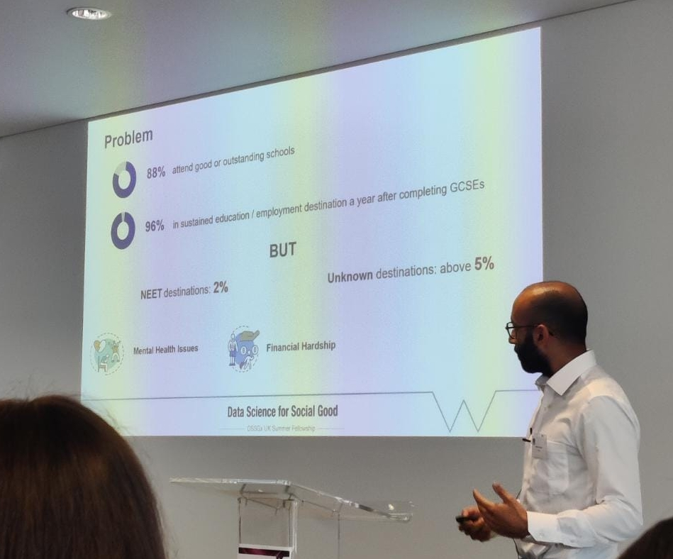

---
tags:
- GraphExclude
title: About Me
---

I grew up in [Dayton, Ohio](https://en.wikipedia.org/wiki/Dayton,_Ohio). We're big enough to be on a map, but small enough that you probably don't know where it is. I then moved to Houston, Texas to get my BA in Mathematics and Computer Science at Rice University (where I was part of Wiess College). After that, I worked for a year and a half as a software engineer at Domino Data Lab. After too many lines of code, I decided I wanted to pursue a PhD in math and came to the University of Illinois @ Chicago. I got my MS in Spring 2021 and decided to stick around for my PhD.

## Academic Interests

[[TODO]]
- [ ] Information theory and machine learning
- [ ] PDEs, topology, and machine learning

## Other Interests

[[TODO]]
- [ ] Hobbies (e.g. chess, baking, video games, running)
- [ ] Kaggle competitions (comical email)
- [ ] DSSG